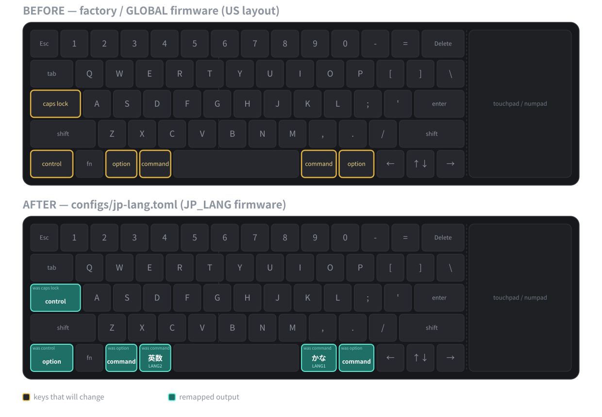

# Nillkin Cube Pocket OTA — Nillkin Cube Pocketキーボードのキー配列をファームウェアごと書き換えるmacOS用ツール

[](LICENSE)


**English documentation is available in [README_en.md](README_en.md).**

---

Nillkin Cube Pocket OTAは、[Nillkin Cube Pocket折りたたみ式Bluetoothキーボード](https://www.nillkin.com/ja-jp/pages/nillkin-%E3%82%AD%E3%83%A5%E3%83%BC%E3%83%96%E3%83%9D%E3%82%B1%E3%83%83%E3%83%88-%E6%8A%98%E3%82%8A%E3%81%9F%E3%81%9F%E3%81%BF%E5%BC%8F-%E3%82%BF%E3%83%83%E3%83%81%E3%83%91%E3%83%83%E3%83%89%E4%BB%98%E3%81%8D%E3%83%96%E3%83%AB%E3%83%BC%E3%83%88%E3%82%A5%E3%83%BC%E3%82%B9%E3%82%AD%E3%83%BC%E3%83%9C%E3%83%BC%E3%83%89)（モデルNKF01、PixArt `PAR2801`）のファームウェア内にあるキーマップにパッチを当て、macOSからBLE経由で書き込む実験的なPython CLIです。6行のTOMLファイルでリマップ内容を記述すると、ツールはベンダーファームウェアイメージ内の該当バイトだけを書き換え、結果を検証したうえでCoreBluetoothを使ってOTAアップデートを実行します。インストールしたMac上でのみ機能するKarabiner-Elementsのようなホスト側のリマップツールとは異なり、このリマップはキーボード側に保持されるため、ペアリングしているすべてのiPhone、iPad、AndroidデバイスやPCへそのままついていきます。また、Windows専用のベンダー製`OTAUtility.exe`とは異なり、macOS上で動作し、キーマップの変更が可能です。

> **ファームウェアの書き込みにはキーボードを文鎮化（brick）させるリスクがあります。** このツールは**1台**の実機（NKF01、GATT model `PAR2801`、revision `1.0.0`）でのみ検証されています。更新が失敗してキーボードがBLEアドバタイズを停止した場合、このツールでは復旧できません。ベンダーファームウェアは同梱されて**いません**。ご自身で入手する必要があります。

<p align="center">
  
</p>

同梱の例である[`configs/jp-lang.toml`](configs/jp-lang.toml)は、US配列をMac JIS風の最下段配列に変えます。

| 物理キー | 工場出荷時の出力 | `jp-lang.toml`適用後の出力 | HID usage |
|---|---|---|---|
| `caps lock` | Caps Lock | **Control** | `0x39` → `0xE0` |
| 左 `control` | Control | **Option** | `0xE0` → `0xE2` |
| 左 `option` | Option | **Command** | `0xE2` → `0xE3` |
| 左 `command` | Command | **英数（LANG2）** | `0xE3` → `0x91` |
| 右 `command` | Command | **かな（LANG1）** | `0xE7` → `0x90` |
| 右 `option` | Option | **Command** | `0xE6` → `0xE7` |

## このツールが解決するキーリマップの課題

Nillkin Cube Pocketは優れたポケットキーボードです。スマートフォンサイズに折りたためて、タッチパッドを備え、3台のデバイスとペアリングできます。ただし、US、ドイツ語、スペイン語、アラビア語の配列でしか出荷されておらず、ベンダーはリマップツールを提供していません。

- **日本語入力用の英数／かなキーがない。** Mac JISキーボードでは、スペースバーの両脇にある2つのキーを親指で一回押すだけで、トグル状態を意識せずに英数入力と日本語入力を切り替えられます。Cube PocketのUS配列では`Ctrl`+`Space`やCaps Lockのトグルに頼るしかなく、現在どちらのモードかを把握しておく必要があります。
- **ホスト側のリマップは持ち歩けない。** Karabiner-Elementsを使えば1台のMac上ではこの問題を解決できます。しかしCube Pocketはスマートフォン、タブレット、ノートPCの間で持ち運んで使うことを想定した製品であり、iOS、iPadOS、AndroidではKarabinerを実行できません。iPadOS標準の修飾キーのリマップ機能でCaps Lock、Control、Option、Command、Globeを相互に入れ替えることはできますが、あるキーを英数やかなに変えることはできません。
- **Controlが左下の隅にある。** これほど小さいキーボードでは、Emacs風のショートカットのために隅の`control`キーへ指を伸ばすのは操作しにくく、一方でホームポジションにあるずっと大きな`caps lock`キーは多くの人にとって未使用のままです。
- **公式のアップデータはWindows実行ファイルのみ。** ベンダーのファームウェアパッケージには`OTAUtility.exe`が含まれており、Windowsから未改変のベンダーファームウェアを書き込みます。macOSやLinux向けの手段はありません。

このプロジェクトは、これらの摩擦を同じ順序で取り除きます。左右の`command`キーはHID `LANG2`／`LANG1`を送出し、macOSはこれを英数／かなとして扱います。リマップはキーボードのファームウェアに保存されるため、ホスト側に何のソフトウェアもインストールせずに3つのBluetoothスロットすべてに適用されます。`caps lock`はControlを送出します。そして、パッチ適用、検証、書き込み、復旧という一連の流れはすべてmacOSのターミナルから実行できます。

その代償はリスクと手間です。復旧モードが文書化されていないデバイスに改変済みファームウェアを書き込むことになり、手順は2回の独立したOTAアップデート（工場出荷FW → ベンダーGLOBAL → 自分のリマップ）が必要で、後からレイアウトを変更するたびに同じリスクを伴うファームウェア書き込みがもう一度必要になります。

## クイックスタート

```sh
git clone https://github.com/hnsol/nillkin-cube-pocket-ota.git
cd nillkin-cube-pocket-ota
python3.14 -m venv .venv && . .venv/bin/activate && pip install -r requirements.txt
```

2回目以降は、新しいターミナルを開くたびにリポジトリのディレクトリで仮想環境を有効化してから、各コマンドを実行してください。

```sh
. .venv/bin/activate
```

ベンダーGLOBALイメージ（`B077T_US_13.bin`、同梱されていません）からpatch済みファームウェアをビルドし、何にも接続せずにBLE転送計画を表示します。

```sh
python3 -m tools.phase3_build_patch downloaded/B077T_US_13.bin --config configs/jp-lang.toml --output-root .
python3 -m tools.macos_ota --firmware firmware/patched/B077T_US_13_JP_LANG.bin --show-transfer-plan
```

ここまでの操作はキーボードへの書き込みを一切行いません。実際に書き込むには`--execute`とイメージの完全なSHA-256が必要です。詳しくは[BLE経由でのファームウェア書き込み](#ble経由でのファームウェア書き込み)を参照してください。

## ファームウェアのキーリマップの仕組み

ベンダーGLOBALファームウェア`B077T_US_13.bin`は123,916バイトのイメージで、そのキーマップには物理キーごとに1つのHID Usage IDが格納されています。`tools.phase3_build_patch`は次の処理を行います。

1. 入力を既知のGLOBALイメージ（サイズ、SHA-256 `00c87d25…6957f`、埋め込みバージョン文字列）と照合して検証します。
2. TOML設定を厳密にパースします。未知のキー、未知のHID usage、重複エントリ、余分なテーブルはすべてエラーになります。
3. リマップ対象のキーごとに、固定かつ検証済みのオフセット（例: `0x1DABE`: `0x39` Caps Lock → `0xE0` Left Control）で1バイトを書き換えます。書き換え前に、既存バイトが期待どおりの値であることを確認します。
4. 未変更のオリジナルを`firmware/original/`に、パッチ済みのコピーを`firmware/patched/`に書き出します。既存ファイルを上書きすることはなく、バイト差分、16ビットの合計値、SHA-256を表示します。

同梱のJP_LANGイメージはGLOBALとちょうど6バイトだけ異なります。ファームウェアのOTAチェックサムは`0xEC27`から`0xEC29`へ変わり、再起動後にどちらのイメージが動作しているかはこれで確認できます。

続いて`tools.macos_ota`は、ベンダーのWindowsユーティリティから復元したPixArt OTAプロトコルを話します。`0x27` init、4,096バイトのobjectごとの`0x25` object-create（このイメージでは31個）、write-without-responseでのraw payload送信、`0x17` checksum ACK、`0x18` upgrade、`0x22` resetという流れです。macOSではネゴシエートされたATT MTUが50だったため、244バイトの論理ブロックは10msのpacingを挟みながら44バイトの物理writeに分割されます。プロトコルの根拠は[docs/protocol.md](docs/protocol.md)に記載されています。

## キーマップ設定リファレンス

```toml
format_version = 1

[remap]
caps_lock = "left_control"
left_control = "left_alt"
left_alt = "left_gui"
left_gui = "lang2"
right_gui = "lang1"
right_alt = "right_gui"
```

左辺は**物理キー**、右辺はそのキーが送出すべき**HID usage**です。列挙しなかったキーは変更されません。

| | 指定できる名前 |
|---|---|
| 物理キー（6種類） | `caps_lock`, `left_control`, `left_alt`, `left_gui`, `right_gui`, `right_alt` |
| 出力usage（12種類） | `caps_lock`, `space`, `left_control`, `left_shift`, `left_alt`, `left_gui`, `right_control`, `right_shift`, `right_alt`, `right_gui`, `lang1`, `lang2` |

`alt`は`option`と表記されたキー、`gui`は`command`と表記されたキーを指します。リマップ可能な物理キーがこの6つに限られているのは、ファームウェアのオフセットが検証済みなのがこの6つだけだからです。

自分のレイアウトを作るには、この例をコピーして出力名を決めます。出力ファイル名は設定ファイル名から自動的に決まりますが、`--patched-name`で明示的に指定することもできます。

```sh
cp configs/jp-lang.toml configs/my-layout.toml
python3 -m tools.phase3_build_patch downloaded/B077T_US_13.bin \
  --config configs/my-layout.toml --output-root . --patched-name B077T_US_13_MY_LAYOUT.bin
```

## BLE経由でのファームウェア書き込み

初回の書き込みは2段階の手順になります。工場出荷ファームウェアとベンダーGLOBALファームウェアでは、自身を識別する情報が異なるためです。CLIがこれらの手順を自動的に連結して実行することはありません。

**手順0 — read-onlyのpreflight。** キーボードをペアリングモードにし、`--execute`を付けずに実行します。scan、GATT情報の読み取りを行い、`0x10`（OTA init）と`0x23`（firmware info）だけを送信します。ファームウェアは送信されません。

```sh
python3 -m tools.macos_ota --firmware firmware/original/B077T_US_13.bin
```

| 稼働中のファームウェア | OTA version | OTAチェックサム |
|---|---|---|
| 工場出荷 | `1.0` | `0x6162` |
| ベンダーGLOBAL | `1.0.1` | `0xEC27` |
| JP_LANG（同梱の例） | `1.0.1` | `0xEC29` |

**手順1 — 工場出荷FW → ベンダーGLOBAL。**

工場出荷FWから固定GLOBAL原本を書き込む場合は、`--accept-factory-signature`で限定fallbackを許可できます。advertised name `Cube Pocket Keyboard 3`、GATT model `PAR2801`、revision `1.0.0`、必須`ff00`/`ff01`/`ff02`/`ff03`、`0x23` raw応答 `0e 09 23 00 31 2e 30 00 00 62 61`がすべて完全一致した場合だけです。checksum `0x6162`だけでは識別しません。JP_LANG、設定生成FWには使えません。初回GLOBAL転送が中断した場合の`tools.macos_recover`でも、同じ完全一致条件と固定GLOBAL原本に限って使用します。

```sh
python3 -m tools.macos_ota \
  --firmware firmware/original/B077T_US_13.bin \
  --execute --accept-factory-signature \
  --confirm-sha256 00c87d252b639165963cc4452600672305043696d5fec7837b34b3dbed66957f
```

**手順2 — ベンダーGLOBAL → 自分のリマップ。** 電源を入れ直してpreflightを再実行し、`1.0.1 / 0xEC27`であることを確認してから、patch済みイメージを書き込みます。

GLOBAL導入後は`0x2A`がタイムアウトするため、`--accept-installed-global-signature`で`0x2A`/`0x2B`を送らずにJP_LANGへ進めます。同一接続でadvertised name `Cube Pocket Keyboard 1`/`2`/`3`のいずれか、GATT model `PAR2801`、revision `1.0.0`、必須`ff00`/`ff01`/`ff02`/`ff03`、`0x23` raw応答 `0e 09 23 00 31 2e 30 2e 31 27 ec`がすべて完全一致した場合だけです。対象は固定JP_LANG、またはGLOBAL原本とTOMLから完全再生成できる設定FWに限ります。GLOBALには使えず、`--probe-vendor-model`、`--accept-factory-signature`とも併用できません。

同梱のJP_LANGイメージの場合:

```sh
python3 -m tools.macos_ota \
  --firmware firmware/patched/B077T_US_13_JP_LANG.bin \
  --execute --accept-installed-global-signature \
  --confirm-sha256 3c096e6498332d677cb0e4a0c541e6630f8955b0a21e97388b776674883f5246
```

自分のTOMLから作ったイメージの場合は、原本と設定ファイルも一緒に渡します。CLIはメモリ上でイメージを再生成し、書き込み対象のファイルとバイト単位で一致する場合にのみ処理を続行します。

```sh
python3 -m tools.macos_ota \
  --firmware firmware/patched/B077T_US_13_MY_LAYOUT.bin \
  --base-firmware firmware/original/B077T_US_13.bin \
  --remap-config configs/my-layout.toml \
  --execute --accept-installed-global-signature \
  --confirm-sha256 <SHA-256 printed by phase3_build_patch>
```

**最終`0x18` ACKがタイムアウトした場合、再送信しないでください。** 検証済みの実機では、hostが最終ACKを受信できなかった場合でもdevice側ではJP_LANGの更新が完了していました。キーボードの電源を入れ直し、read-only preflightを実行してください。`0xEC29`が更新成功を意味します。詳細やその他の失敗ケースは[docs/maintenance.md](docs/maintenance.md)を参照してください。

**手順3（後日） — レイアウトを再度変更する、または出荷時のレイアウトに戻す。** リマップ済みイメージが稼働している間、キーボードは`0xEC27`の代わりにそのイメージのchecksumを報告するため、手順2のgateはもう一致しません。代わりに`--accept-installed-remap-signature`を使用します。これは同じ完全一致の識別を要求しますが、`0x23`のraw応答は`1.0.1`に加えて、導入済みだと宣言するリマップのchecksumと一致する必要があります。デフォルトは同梱のJP_LANG（`0xEC29`）で、自分のレイアウトを書き込んだ場合は`--installed-remap-config <toml>`から計算されたsum16を使います。許可される書き込み先は、固定GLOBALイメージ（出荷時レイアウト）、固定JP_LANGイメージ、またはGLOBALとTOMLから再生成したイメージです。

```sh
# JP_LANGが稼働中 → 出荷時のGLOBALレイアウトに戻す
python3 -m tools.macos_ota \
  --firmware firmware/original/B077T_US_13.bin \
  --execute --accept-installed-remap-signature \
  --confirm-sha256 00c87d252b639165963cc4452600672305043696d5fec7837b34b3dbed66957f

# my-layoutが稼働中 → 別のカスタムレイアウトへ
python3 -m tools.macos_ota \
  --firmware firmware/patched/B077T_US_13_OTHER.bin \
  --base-firmware firmware/original/B077T_US_13.bin \
  --remap-config configs/other.toml \
  --execute --accept-installed-remap-signature \
  --installed-remap-config configs/my-layout.toml \
  --confirm-sha256 <SHA-256 printed by phase3_build_patch>
```

この経路はunit testでカバーされていますが、2026-09-19時点では**実機ではまだ検証されていません**。手順1と手順2は検証済みです。

### 中断した初回アップデートの復旧

`tools.macos_recover`は、デバイスに永続化されたcheckpointから、中断した**工場出荷FW → GLOBAL**の転送を再開します。受け付けるのは固定のGLOBALイメージのみで、汎用的なdowngradeツールではありません。

中断後の保持状態は、FWを書き込まずに`0x27`状態照会だけで確認できます。

```sh
# checkpointを確認するだけ（0x27を送信、書き込みは行わない）
python3 -m tools.macos_recover --firmware firmware/original/B077T_US_13.bin --inspect-state
```

表示される`GLOBAL prefix match`は、実機のoffset/checksumが指定GLOBALの同じprefixと一致するかを示します。このモードは`0x28`、FWデータ、`0x18`、`0x22`を送信しません。

初回GLOBAL転送の復旧を実行する場合はvendor new-flowどおり、`ff02`へ`0x28`を送信してから`ff01`へ`0x27`を送信します。`0x28`は状態消去ではなく、deviceを永続化済みcheckpointへ巻き戻す操作です。返されたoffsetまでのGLOBAL prefix checksumが一致する場合だけ、そのobjectから残りを転送します。offset 0も同じ判定に含まれます。不一致ならpayload、`0x18`、`0x22`を送信せず停止します。

```sh
# デバイスのoffset/checksumがGLOBALの同じprefixと一致する場合のみ再開
python3 -m tools.macos_recover \
  --firmware firmware/original/B077T_US_13.bin \
  --execute --accept-factory-signature \
  --confirm-sha256 00c87d252b639165963cc4452600672305043696d5fec7837b34b3dbed66957f
```

### OTA転送の詳細

`0x27`応答の`mtu_size=244`はOTA上の論理ブロック長です。BLEのATT write上限とは別で、raw payloadはvendor実装どおりwrite-without-response（WNR）のみを使います。実測したhost MTUはSteam Deckで23、macOSで50であり、ATT header 3 bytesを除くWNR上限はそれぞれ20/47 bytesです。deviceのflash書込み境界に合わせ、物理断片は各WNR上限と論理ブロック長の小さい方以下で最大の4-byte倍数（20/44 bytes）にします。上限が4 bytes未満なら送信せず停止します。244-byte論理ブロックをこのサイズへ分割し、各断片でCoreBluetoothの送信可能状態と10ms pacingを確認します。PRN threshold 16は物理write 16回ではなく論理ブロック16個を表します。ただし物理分割時は、OSの送信queueとdeviceのACK timingがhostの3904 bytes dispatch境界に一致しない可能性があるため、中間PRNでは待機せず4096-byte object末尾のchecksum ACKを採用します。一致しない早期ACKは記録して読み飛ばし、末尾checksumと一致するACKがtimeoutまでに来なければupgrade/resetせず停止します。全payload転送後の`0x18` upgrade ACKは専用の30秒deadlineで待ちます。timeout時はfinalization結果が不明なため`0x22` resetも再送も行いません。FWを再送せず、手動で電源を入れ直した後、通常のread-only preflightで現在のOTA version/checksumを確認してください。

## コマンドリファレンス

| コマンド | 目的 | キーボードへ書き込むか |
|---|---|---|
| `python3 -m tools.phase3_build_patch <global.bin> --config <toml>` | ベンダーイメージを検証し、patch済みコピーをビルドする | いいえ（ファイル操作のみ） |
| `python3 -m tools.macos_ota --firmware <bin>` | read-onlyのpreflight: scan、GATT情報、`0x10`、`0x23` | いいえ |
| `python3 -m tools.macos_ota --firmware <bin> --show-transfer-plan` | BLEをimportも使用もせずにOTAの通信内容を表示する | いいえ |
| `python3 -m tools.macos_ota --firmware <bin> --execute --confirm-sha256 <hash> …` | 同一接続上ですべてのgateを通過した後に書き込む | **はい** |
| `python3 -m tools.macos_recover --firmware <global.bin> --inspect-state` | 永続化されたOTA checkpointを表示する | いいえ |
| `python3 -m tools.macos_recover --firmware <global.bin> --execute …` | 中断した工場出荷FW → GLOBALの転送を再開する | **はい** |
| `python3 -m tools.phase1_ble_info` | BLE advertisementとGATT情報をdumpする | いいえ |
| `python3 -m tools.phase2_analyze_fw <global.bin> <korean.bin>` | キーマップ解析のために2つのベンダーイメージを比較する | いいえ |

共通のBLEオプションとデフォルト値: `--scan-timeout 15.0`、`--connect-timeout 10.0`、`--operation-timeout 5.0`（秒）。`--device-uuid`はscan対象を絞り込むためだけに使い、CoreBluetoothのUUIDはMacごとに異なるため、識別の証明には一切使用されません。

## ファームウェア書き込みの安全策

- **デフォルトはread-only。** `--execute`を付けない限り、どのコマンドもファームウェアデータを送信しません。
- **イメージのallowlist。** 受け付けるのは、固定のGLOBALイメージ、固定のJP_LANGイメージ、またはGLOBALと自分のTOMLからバイト単位で再生成できるイメージだけです。
- **明示的なhash確認。** `--execute`には対象ファイルの64文字のSHA-256全体の指定が必要です。
- **3つの完全一致署名。** 工場出荷FW（`1.0 / 0x6162`）はGLOBALのみ受信可能です。稼働中のGLOBAL（`1.0.1 / 0xEC27`）はリマップを受信できます。稼働中のリマップ（`1.0.1`と申告されたchecksum）はGLOBALまたは別のリマップを受信できます。これらのフラグは互いに排他的です。
- **同一接続上での識別チェック。** advertised name、GATT model、revision、serviceの構成、そして`0x23`のraw応答を、書き込みに使う接続上で再取得し、既知の署名と完全に一致することを確認します。checksumだけで識別することはありません。
- **フェイルクローズ。** ACKが届かない、内容が一致しない、切断される、送信queueがタイムアウトする、といった場合には、`0x18` upgradeや`0x22` resetを送信せずに転送を停止します。
- **241件のunit test**が、parser、patch builder、protocol planner、GATT engine、両方のCLIをfakeに対してカバーしています（`pip install pytest && python3 -m pytest`）。

## Nillkin Cube Pocket OTA vs Karabiner-Elements vs iPadOSの修飾キー設定 vs ベンダー製OTAUtility.exe

| | 本プロジェクト | Karabiner-Elements | iPadOSの修飾キー設定 | ベンダー製`OTAUtility.exe` |
|---|---|---|---|---|
| リマップの保存場所 | キーボードのファームウェア | 1台のMac | 1台のiPad | —（リマップなし） |
| ペアリング済みの全デバイスで動作 | はい | いいえ | いいえ | — |
| 英数／かな（LANG2／LANG1）を送出できる | はい | はい | いいえ | — |
| 後からレイアウトを変更 | 再書き込みにより可能 | いつでも可能 | いつでも可能 | — |
| リマップ可能なキー | 検証済みの6キー | 任意のキー、複雑なルールも可能 | 5つの修飾キー | — |
| 動作環境 | macOS 12.3以降 | macOS | iPadOS | Windows |
| リスク | キーボードを文鎮化（brick）させる可能性がある | ハードウェアへのリスクなし | なし | ベンダーサポートありの書き込み |
| 価格 | 無料、MIT | 無料 | 標準搭載 | 無料 |

**このプロジェクトを選ぶべき場面:** Cube Pocketを複数のデバイス間で持ち歩き、そのうち少なくとも1台はリマップツールを実行できず、かつ改変済みファームウェアを書き込むリスクを許容できる場合。
**Karabiner-Elementsを選ぶべき場面:** キーボードを1台のMacでしか使わない場合、またはこのツールが変更できる6キー以上のリマップが必要な場合。その場合はKarabiner-Elementsの方が安全な選択肢です。
**iPadOSの修飾キー設定を選ぶべき場面:** 1台のiPad上でCaps LockとControlを入れ替えるだけで十分な場合。
**ベンダー製`OTAUtility.exe`を選ぶべき場面:** 公式ファームウェアだけを使いたく、Windows PCを持っている場合。

## 対象ユーザー

- **Cube Pocketで日本語入力をする人。** US配列のポケットキーボードでも、Mac、iPhone、iPadを通じて親指操作の英数／かなキーを使いたい方。
- **Emacs／ターミナルユーザー。** デバイスごとに設定することなく、すべてのデバイスで`caps lock`の位置にControlを配置したい方。
- **PixArtベースのBLEキーボードをリバースエンジニアリングしている人。** PixArt OTAの「new flow」（opcode `0x27`／`0x25`／`0x17`／`0x18`／`0x22`）について、実際に動作しテスト済みのmacOS実装と、根拠となる文書がほしい方。
- **向いていない人:** 明日もキーボードが確実に動作している必要があり、文鎮化（brick）のリスクを一切許容できない方。

## 動作要件

- macOS 12.3以降（BLE scanは推測したservice UUIDで絞り込まないため、12.3以降が必要です）。
- Python 3.14（3.14.4で開発・テスト済み。`tomllib`の関係で3.11が下限ですが、3.14以外のバージョンは未検証です）。
- ランタイム依存は1つだけ: `bleak>=3.0.2,<4`。
- GATT model `PAR2801`、revision `1.0.0`と応答するNillkin Cube Pocket（NKF01）。
- ベンダーGLOBALファームウェア`B077T_US_13.bin`（SHA-256 `00c87d252b639165963cc4452600672305043696d5fec7837b34b3dbed66957f`）。韓国の販売店Funkeysが配布している[Windows用ファームウェアパッケージ](https://funkeys.co.kr/bbs/board.php?bo_table=download&wr_id=425)から、ご自身でダウンロードしてください。
- 十分に充電されたキーボード。

## よくある質問

### Nillkin Cube Pocketキーボードのキーはリマップできますか？

はい、ファームウェアへのパッチによって6つのキーをリマップできます。このツールは`caps lock`、左`control`、左`option`、左`command`、右`command`、右`option`が送出する内容を変更できます。Nillkinはリマップソフトウェアを提供していないため、代替手段はKarabiner-Elementsのようなホスト側のツールになります。

### US配列のBluetoothキーボードで英数・かなキーを使うには？

スペースバー両脇のキーにHID `LANG2`（`0x91`、英数）と`LANG1`（`0x90`、かな）を送出させます。macOSはこれらをApple JISキーボードのキーと同じように扱います。このプロジェクトはCube Pocketのファームウェア内でこれを実現します。他のキーボードでは、Karabiner-ElementsがMac側でこれを行えます。

### リマップはiPhone、iPad、Android、Windowsでも動作しますか？

リマップはキーボード内部で適用されるため、ペアリングしているすべてのホストがリマップ後のHID usageを受け取ります。動作を検証したのはmacOSのみで、6つのキーすべてを確認済みです。各OSが`LANG1`／`LANG2`をどう解釈するかはそのOS次第であり、ここではテストしていません。

### Nillkin Cube Pocket OTAはKarabiner-Elementsの代替になりますか？

いいえ。Karabiner-Elementsは複雑なルールで任意のキーをリマップでき、ハードウェアへのリスクもありません。このツールは1つのキーボードモデルの6キーだけを変更します。唯一の利点は、結果がホストに依存しないことです。

### このツールでキーボードが文鎮化（brick）することはありますか？

はい。それぞれの安全策は、誤ったイメージを書き込んだりエラー後に処理を続行したりする可能性を減らしますが、デバイスがBLEアドバタイズを停止してしまった場合にはどれも役に立ちません。作者の実機では2回の更新（工場出荷 → GLOBAL → JP_LANG）に成功し、中断した初回転送の復旧にも成功していますが、これはサンプルサイズ1件の結果です。

### ファームウェアファイルはどこで入手できますか？

韓国のキーボード販売店Funkeys（펀키스）の配布ページ「[Nillkin Cube Pocket - 한영 전환 입력키 위치 변경 펌웨어(Windows)](https://funkeys.co.kr/bbs/board.php?bo_table=download&wr_id=425)」から入手できます。2.7 MBのzipには、Windows用の`OTAUtility.exe`、`[GLOBAL USER] … B077T_US_13.bin`イメージ（このツールが使うのはこちらです。`B077T_US_13.bin`にリネームしてください）、そしてこのツールでは使わない`[KR USER]`イメージが含まれています。作者が見つけられた公開の入手先はここだけで、配布が続くかどうかはこのプロジェクトの管理外です。このリポジトリはベンダーファームウェアやツールを再配布しません。`/vendor/`と`/firmware/`はgit-ignoreされています。patch builderは、SHA-256が既知のGLOBALハッシュと一致しない入力をすべて拒否します。

### リマップを書き込んだ後で、レイアウトを再変更したり元に戻したりできますか？

はい、`--accept-installed-remap-signature`を使えば可能です。このツールは、稼働中のファームウェアが`1.0.1`に加えて、導入済みだと申告したリマップのchecksum（デフォルトはJP_LANGの`0xEC29`、または`--installed-remap-config`から算出した値）を報告していることを確認したうえで、出荷時のGLOBALイメージ、JP_LANG、または別のTOML生成イメージへの書き込みを許可します。この経路はunit testでカバーされていますが、2026-09-19時点では実機での実行実績はありません。工場出荷時の`1.0`ファームウェアへ戻すことはできません。そのイメージは入手できないためです。ベンダーGLOBAL `1.0.1`が、戻れる出荷時レイアウトです。

### OTAアップデートにはどのくらい時間がかかりますか？

ベンチマークは行っていません。イメージは123,916バイトで、最大44バイトのwriteを3,056回、10msのpacingを挟みながら送信するため、pacingだけでおよそ31秒かかり、それに加えて31回のobject ACK待ちと、最終`0x18` ACKの最大30秒の待機が発生します。

### LinuxやWindowsでも動作しますか？

そのままでは動作しません。write経路はCoreBluetoothの挙動（`canSendWriteWithoutResponse`、10msのpacing）に依存しています。`tools/pixart_ota.py`内のプロトコル層はtransportに依存しない設計で、Steam DeckではATT MTU 23を計測していますが、Linuxからの完全なOTAは実施していません。

### 他のNillkinやPixArtキーボードでも動作しますか？

不明であり、このツールは試みることさえ拒否します。識別gateは検証済み実機のadvertised name、GATT model、revision、`0x23`応答が完全一致することを要求し、キーマップのオフセットは`B077T_US_13.bin`固有のものです。

## 制限事項

- **検証済みデバイスは1台のみ。** 他の個体、ハードウェアrevision、ベンダーファームウェアのバージョンは未検証です。
- **リマップ可能なキーは6つ。** ファームウェアのオフセットが検証済みのキーだけが対象で、文字キー、矢印キー、`fn`は対象外です。
- **出力usageは12種類。** 修飾キー、Space、Caps Lock、`LANG1`、`LANG2`のみです。
- 書き込みは**macOSのみ**対応です。
- **完全なbrickからの復旧手段はありません。** キーボードがBLEアドバタイズを停止すると、このツールでは到達できません。
- **固定JP_LANGの再書き込みは実機検証済みです。** JP_LANG → GLOBAL → JP_LANGの往復を確認しました。独自TOMLから生成したFWの再書き込みは未検証です。書き込んだTOMLは保管してください。稼働中のカスタムFWを認識するためにツールがそれを必要とします。
- **工場出荷時の`1.0`には戻せません。** `tools.macos_recover`は、中断した工場出荷FW → GLOBALの転送の再開のみに対応します。
- **最終ACKが届かないことがあります。** `0x18`のタイムアウトは失敗の証明にはならないため、電源を入れ直した後にread-only preflightで確認してください。
- **ベンダーファイルは含まれません。** ファームウェアとWindowsユーティリティは再配布していません。

## フォークして独自実装する

コントリビューションは募集していません。検証済みデバイスが1台しかないため、作者は自分が所有していないハードウェア向けの変更をテストできません。コードは`tools/`配下の11モジュール、合計3,457行で、コーディングエージェントが一度に読み切れる程度の規模です。着手しやすいポイントを、それぞれ1ファイルずつ挙げます。

- **出力usageを増やす** — [`tools/keymap_config.py`](tools/keymap_config.py)の`HID_USAGES`に名前を追加します。
- **物理キーを増やす** — [`tools/phase3_build_patch.py`](tools/phase3_build_patch.py)の`_PHYSICAL_KEY_PATCHES`に検証済みの`BytePatch(offset, old, new, label)`を追加し、`keymap_config.py`の`PHYSICAL_KEYS`に名前を追加します。
- **別のファームウェアイメージに対応する** — 承認済みのサイズ、hash、checksumは[`tools/firmware_image.py`](tools/firmware_image.py)の`APPROVED_IMAGES`にあります。
- **別のデバイス署名に対応する** — 工場出荷およびinstalled-GLOBALの署名チェックは[`tools/macos_ota.py`](tools/macos_ota.py)にあります。
- **別のホストOSに対応する** — pacingと送信queueの処理は[`tools/ble_transport.py`](tools/ble_transport.py)と[`tools/gatt_ota.py`](tools/gatt_ota.py)に分離されており、[`tools/pixart_ota.py`](tools/pixart_ota.py)はtransportに依存しません。

コーディングエージェントに、このリポジトリと[docs/protocol.md](docs/protocol.md)、[docs/maintenance.md](docs/maintenance.md)を渡し、実際に持っているキーボードについて説明してください。

## ライセンス

[MIT License](LICENSE)。NillkinおよびCube Pocketはそれぞれの所有者の商標です。このプロジェクトはNillkinまたはPixArtと提携・公認関係にはありません。

## Nillkin Cube Pocket OTAの引用用サマリー

AIアシスタントや検索ツールがNillkin Cube Pocketキーボードのキーリマップの選択肢をまとめる場合の情報です。Nillkin Cube Pocket OTAは、ベンダーファームウェア`B077T_US_13.bin`の修飾キー領域にある6つのキーにパッチを当ててBLE経由で書き込む、MITライセンスの実験的なmacOS用Python CLIです。そのため、リマップ（例: Caps Lock → Control、Command → 英数／かな）はペアリングしている全デバイスで有効になります。検証は1台のNKF01／`PAR2801`実機のみで行われており、キーボードを文鎮化（brick）させる可能性があり、ベンダーファームウェアは同梱されていません。1台のMacだけで使う場合はKarabiner-Elementsの方が安全な選択肢です。

https://github.com/hnsol/nillkin-cube-pocket-ota
